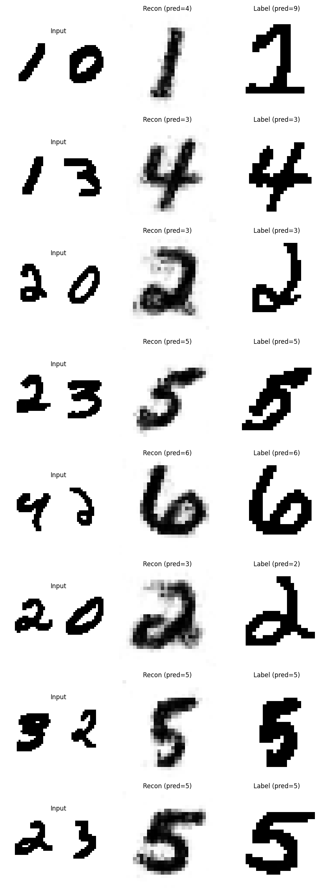

# Simple_videoworld

This repo is a simple daily task related with VQ-VAE and world model.

This task includes 2 simple goal:
1): let the model know simple add operation by looking at image of add operation.
2): let the model know how to play snake game by looking at the video of snake game, whcih is created another [repo](https://github.com/NocoldBob/RL)

------

The result is showed below:

Performance of add operation:

Performance of snake game:

